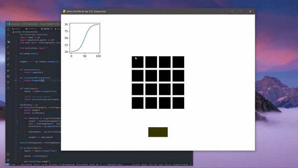
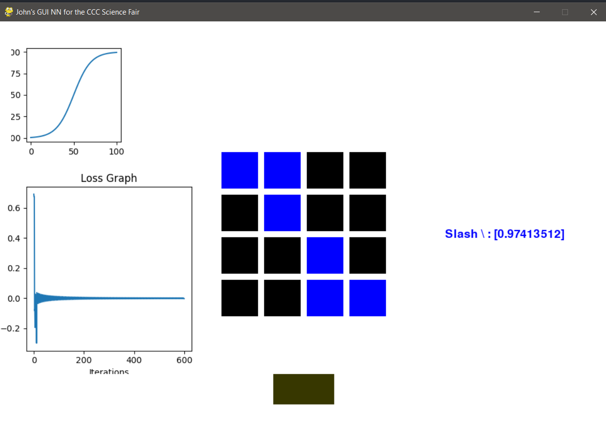
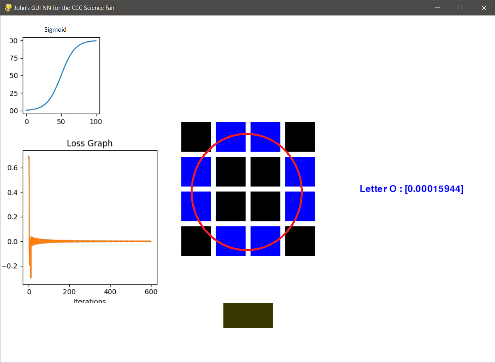
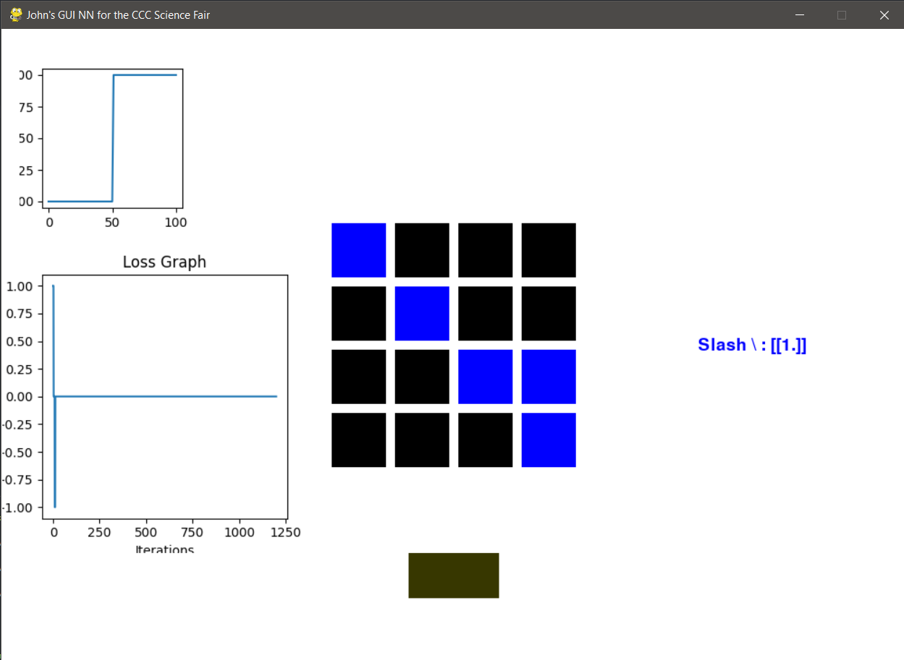
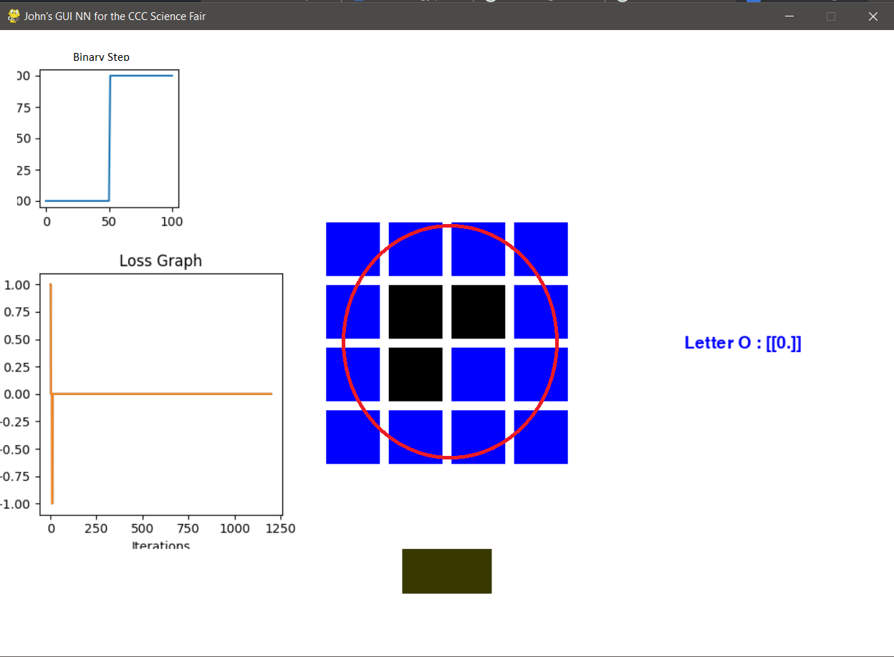
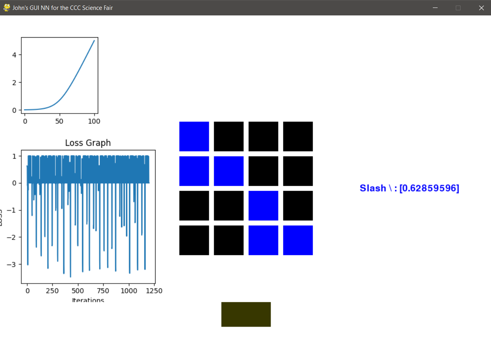
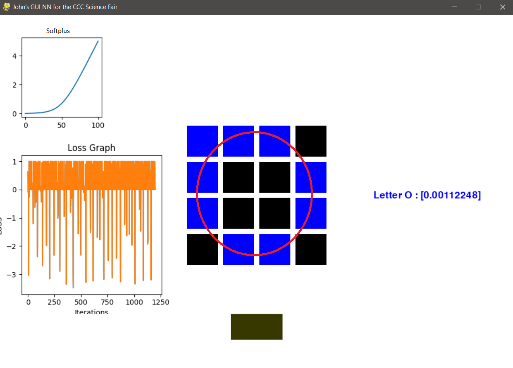
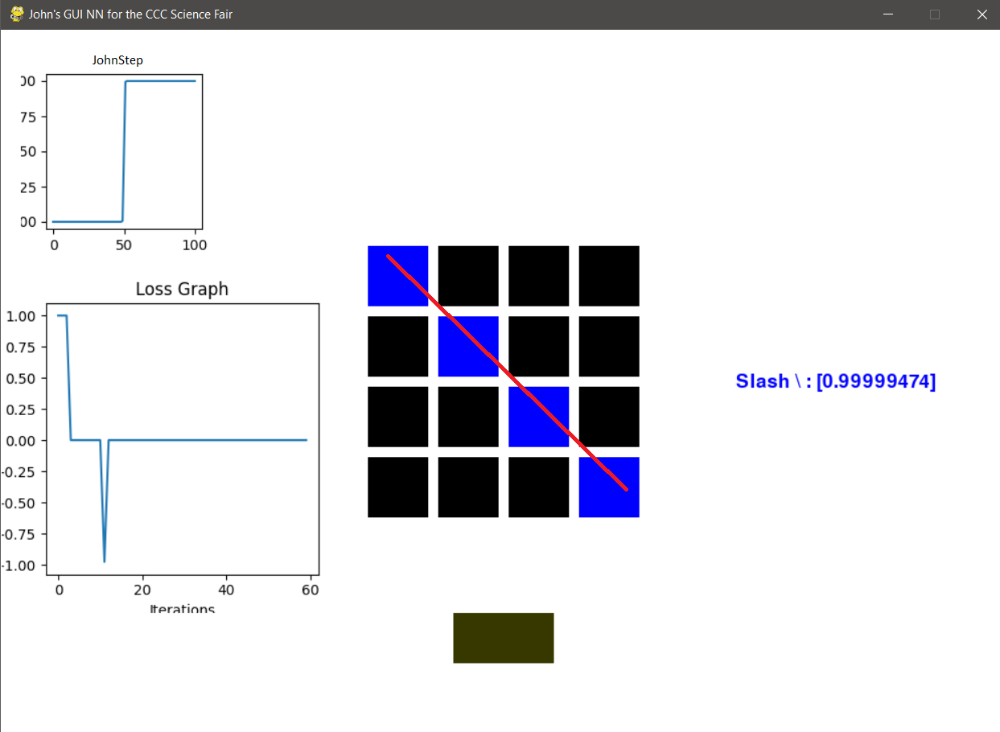
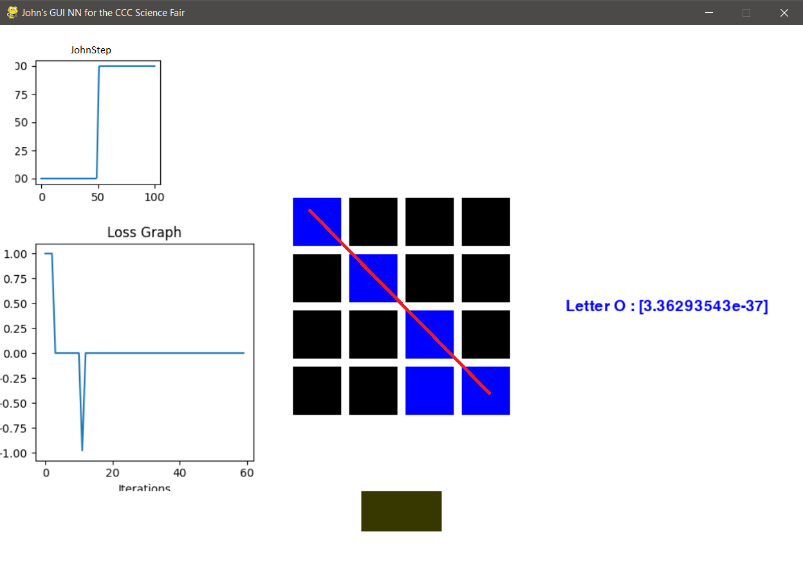
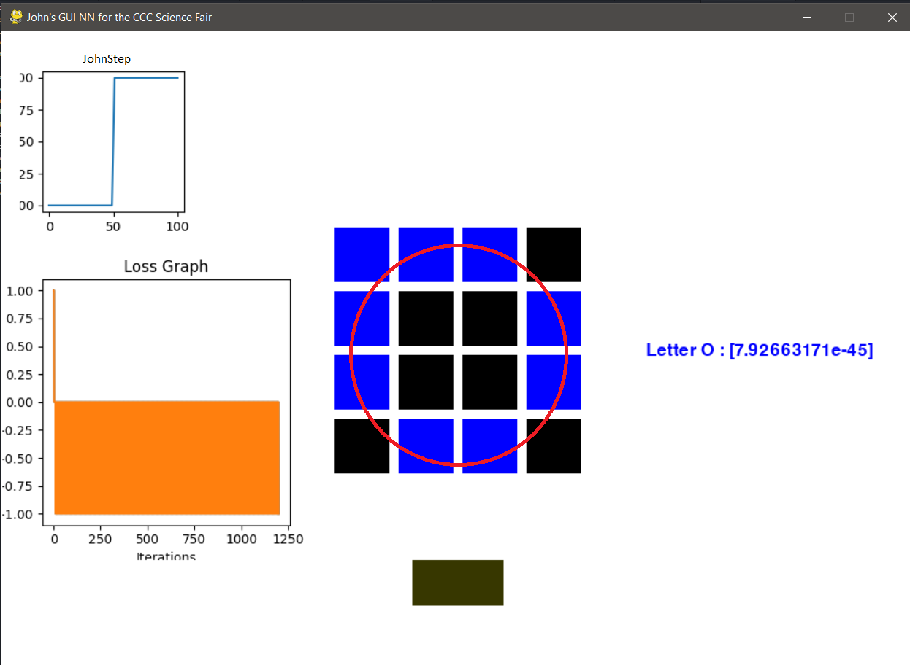

## How do various activation functions affect the output of a neural network?

# Activations Functions tested:

Sigmoid()     = 1/(1+e^(-x))

ReLU()        = MAX(0, x)

Softplus()    = log(1+exp(x))

Binary Step() = if x >=0 : x = 1; if x < 0 : x = 0

# Abstract
What is the importance of figuring out what activation function works the best? Well, this brings us back to the importance of artificial neural networks.

While my neural network simply recognized Os and slashes, when scales up, classification neural networks like this have been used in a plethora of ways such as recognizing tumours in radiology, assisting/helping the military better identify threats, and more.

## ---------------------------------------------------------

What is an artificial Neural Network?
An Artificial Neural Network (or ANN) works similarly to the brain. It's a collection of nodes (AKA neurons) that are assigned certain values (Called weights)...

Essentially, you use neural networks when you have certain inputs, and you have preferred outputs, and you want to create a function that gives you these preferred outputs given simular, but different inputs. 

These weight values are random to start, but they are tweaked during the training process through a process called Gradient Decent.
Gradient descent is the process of calculating how wrong the model is(% Error), finding the minimum of the "Loss function", and generating adjustments values to tweak the weights (making the model less wrong). Gradient Decent does this by taking the derivative at a point on the loss function (To get the slope) and it then moves one unit(The learning rate) in the downward direction of that slope until it reaches the minimum. This process is done over an over again until the model is "trained"
Once the model is trained, you can give it an input(Even an input it's never seen before) and give you the preferred output.

For my neural network, I'm going to be predicting Xs and Os.

Essentially think of ANN'S (And your brain) and one big regression calculator.

That's all what's going on! A super complex regression!

------------

One key component in an ANN is what's called an "Activation Function," in fact, the output of the activation function is the output of that node/neuron. Not only that, but the activation function (And it's derivative) is crucial in the training process.

So what's inputted into the activation function? Well, the inputs is just the dot product of the weight vector (We were talking about) and the input vector.

In mathematical notation, it looks like this:
ActivationFunction(dot(i, w))

The activation function you choose for your model depends on what you're trying to accomplish. 
Some activation functions have limits in the infinity positive or negative direction <Show image of Sigmoid Limits>, this can be useful if the range of possible outputs are restricted. Another deciding factor in choosing an activation function is how fast it is, some functions such as ReLU take less operation to compute.
  
Interesting enough, there is an infinite number of activation function, but in this experiment, only the most popular ones will be tested.

## The question now arises, what is this magical activation function?

Well, it does a few things. It plays a significant role in the training process, and it sometimes limits outputs that get too small or too large.

Well, this brings us to another question, what activation function should I use for the task I'm trying to complete?

Well, we'll have to find out....

In this experiment, I'll be testing the following activation functions:

Sigmoid
<insert graph>

ReLU
<insert graph>

Binary Step
<insert graph>

And softplus
<insert graph>

The neural network that I'll be using has a simple task, recognizing patterns in matrix. More specifically, recognizing Xs and Os

## My hypothesis is that the Binary Step will produce the most accurate prediction (When it's right) but the Sigmoid will produce the most accurate prediction over the most tests.

## The results

# Lab in action (Sigmoid)

# Sigmoid:
To predict Slash:

To predict O:

# Binary Step:
To predict Slash:

To predict O:

# Softplus:
To predict Slash:

To predict O:

# JohnStep (My activation):
To predict Slash:

Works when presented training input:

Any alteration and it was incorrect:

To predict O:

- Notice how my activation function was accurate for the letter O, but had somewhat of a bias toward the O since it only correctly predicted the slash when the inputs perfectly matched the training inputs.

## Conclusion 

The best activation function for this task was ---- I suspect this is because 
