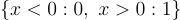
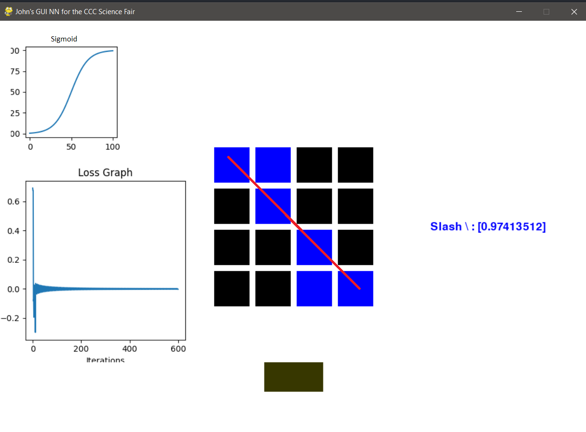
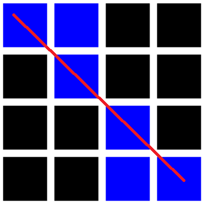
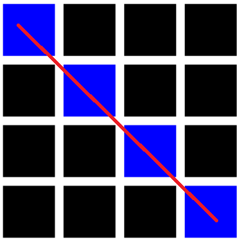
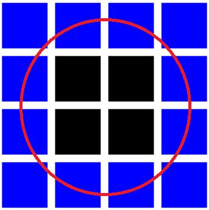
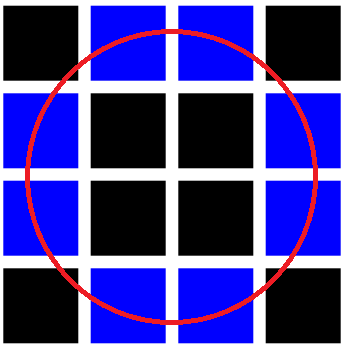

## How do various activation functions affect the output of a neural network?

# Activations Functions tested:

Sigmoid()     = 1/(1+e^(-x))

ReLU()        = MAX(0, x)

Softplus()    = log(1+exp(x))

Binary Step() = if x >=0 : x = 1; if x < 0 : x = 0

# Abstract

In machine learning, artificial neural networks take advantage of what's called "activation functions". These functions determine the final output of a node/neuron and determines whether or not if should fire/synapses (Simularly to a real brain). 

Determining what activation function to use is no easy task, but through trial and error, researchers have found some activation functions to be more affective for different tasks. 

Developers building classification neural networks instinctively use what's called the sigmoid activation, although I'd like to challenge this, there must be another neural network with less loss. 

What is the importance of figuring out what activation function works the best? Well, this brings us back to the importance of artificial neural networks.
While this is a rather niche test case, when scaled up, classification neural networks like these have been used in a plethora of ways such as recognizing tumours in radiology, assisting/helping the military better identify threats, and more. 

In my experiment, I will use the scientific method to determine which activation function is most suitable for recognizing slashes and Os in a 4 by 4 matrix of pixels.

To determine this, I will render a loss graph for each activation function (The loss graph calculates the difference between the output and the preferred output over a period training iterations). The training data will be kept constant across all experiments, although I will change the input for thr sake of demonstration. This will not affect the accuracy of the experience however since the loss history is determined by the training data. The activation function I'll be testing includes the sigmoid, BinaryStep, Softplus, and the JohnStep(My own activation function). 

My hypothesis is that the Binary Step will produce the most accurate prediction (When it's right) but the Sigmoid will produce the most accurate prediction over the most tests. 

Or 

The results I've found was that that the binary step and Sigmoid function were the most accurate, while my own activation along with the softplus were reasonable, but nevertheless the least accurate.

## ---------------------------------------------------------

What is an artificial Neural Network?
An Artificial Neural Network (or ANN) works similarly to the brain. It's a collection of nodes (AKA neurons) that are assigned certain values (Called weights)...

Essentially, you use neural networks when you have certain inputs, and you have preferred outputs, and you want to create a function that gives you these preferred outputs given simular, but different inputs. 

These weight values are random to start, but they are tweaked during the training process through a process called Gradient Decent.
Gradient descent is the process of calculating how wrong the model is(% Error), finding the minimum of the "Loss function", and generating adjustments values to tweak the weights (making the model less wrong). Gradient Decent does this by taking the derivative at a point on the loss function (To get the slope) and it then moves one unit(The learning rate) in the downward direction of that slope until it reaches the minimum. This process is done over an over again until the model is "trained"
Once the model is trained, you can give it an input(Even an input it's never seen before) and give you the preferred output.

For my neural network, I'm going to be predicting Xs and Os.

Essentially think of ANN'S (And your brain) and one big regression calculator.

That's all what's going on! A super complex regression!

------------

One key component in an ANN is what's called an "Activation Function," in fact, the output of the activation function is the output of that node/neuron. Not only that, but the activation function (And it's derivative) is crucial in the training process.

So what's inputted into the activation function? Well, the inputs is just the dot product of the weight vector (We were talking about) and the input vector.

In mathematical notation, it looks like this:
ActivationFunction(dot(i, w))

The activation function you choose for your model depends on what you're trying to accomplish. 
Some activation functions have limits in the infinity positive or negative direction <Show image of Sigmoid Limits>, this can be useful if the range of possible outputs are restricted. Another deciding factor in choosing an activation function is how fast it is, some functions such as ReLU take less operation to compute.
  
Interesting enough, there is an infinite number of activation function, but in this experiment, only the most popular ones will be tested.

## The question now arises, what is this magical activation function?

Well, it does a few things. It plays a significant role in the training process, and it sometimes limits outputs that get too small or too large.

Well, this brings us to another question, what activation function should I use for the task I'm trying to complete?

Well, we'll have to find out....

In this experiment, I'll be testing the following activation functions:

Sigmoid  

JohnStep  

Binary Step  

And Softplus  

The neural network that I'll be using has a simple task, recognizing patterns in matrix. More specifically, recognizing Xs and Os

## My hypothesis is that the Binary Step will produce the most accurate prediction (When it's right) but the Sigmoid will produce the most accurate prediction over the most tests.

## The results

# Lab in action (Sigmoid)

# Sigmoid:
To predict Slash:

To predict O:

loss for slash = 1 - 0.97413512 = .02586488

loss for O = 0.00015944 - 0 = 0.0015944

average loss = (.02586488 + 0.0015944)/2 = **0.1301216**

# Binary Step:
To predict Slash:

To predict O:

loss for slash = 1 - 1 = 0

loss for O = 0 - 0 = 0

average loss = (0 + 0)/2 = **0**

# Softplus:
To predict Slash:

To predict O:

loss for slash = 1 - 0.62859596 = .37140404

loss for O = 0.00113348 - 0 = 0.00113348

average loss = (.37140404 + .00113348)/2 = **0.18626326**

# JohnStep (My activation):
To predict Slash:

To predict O:

loss for slash = 1 - 1 = 0

loss for O = 7.92663171e-45 - 0 = 7.92663171e-45 (Negative Loss!)

average loss = **(7.92663171e-45)/2**

- Notice how my activation function was accurate for the letter O, but had somewhat of a bias toward the O since it only correctly predicted the slash when the inputs perfectly matched the training inputs.

Since the inputs varided in the examples for the sake of demonstrating the model's predictbilty, below is a table of multiple test runs where all activation functions were given the xat same inputs.

|  **Activation Function** |  **loss of Slash:**   |  **loss of Slash:**   |  **loss of O:**   |  **loss of O:**    | **Average Loss** |
|-|-|-|-|-|-|
| Sigmoid (2nd place) | 0.04308203 | 0.00474277 | 0.00051447 | 0.00021294 | 0.01213811 |
| Binary Step (Winner) | 0.0 | 0.0 | 0.0 | 0.0 | 0.0 |
| Softplus | 0.32320652| 1.99036231 | 0.00069685 | 0.00076116 | 0.57875671 |
| JohnStep  | 0.0 | 0.0  | 2.73948305e-40 | 3.4227851e-70 | TBC |

## Conclusion 

The best activation function for this task was ---- I suspect this is because 

The reason the Sofplus didn't do as well is becuase it does not range strictly from 0 to 1, instead it ranges from 0 to infinity this allows the output to be greator than 1 which is not usefull in this case.

The JohnStep attempted to combine both the Sigmoid and the Binary Step (The two most effective activations).
While the JohnStep predicted slashes with ease (No loss), some weird behavior arose when predicting the letter O. As seen in the loss graph, the loss went into the negatives and stayed there, this is odd behavior.
